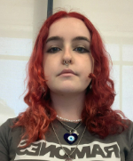

# CURRICULUM

## Alba Cañellas

### Presentación
Soy una persona responsable y trabajadora que le gusta tener todo en orden. Soy perfeccionista y me gusta aprender cosas nuevas cada dia. Me intereso por todos tipos de sectores. Se trabajar en equipos y me considero una buena lider.

### Habilidades
- Trabajo en equipo
- Responsabilidad
- Creatividad
- Gestion del tiempo

### Idiomas 
1. **Español** Es mi idioma nativo, lo escribo y hablo con fluidez.
2. **Catalan** De igual manera, el catalan es mi segundo idioma asi que tambien lo hablo y escribo con fluidez.
3. **Inglés** Desde los 4 años estoy en clases de ingles, es un idiota que aun no dominando por completo, puedo llegar a hablarlo con fluideza y lo entiendo a la perfección.

### Formación
- 2021-2022

_Ciclo medio Sistemas Microinformaticos y redes_:
En la actualidad estoy cursando el segundo curso de Sistemas Microinormaticos y redes en IFP Hospitalet. Tengo habilidad con word, excel y access. Tambien tengo conocimiento de Hardware

- 2007-2015

_Educacion Primaria_:
Cursé mi educacion primaria en CEIP Progrés (Badalona)

### Informacíon de contacto
**Móvil**: +34 866743986
**Correo Electrónico**: pepitafplores@gmail.com
**Dirección** 1120 Westchester Pl, Los Angeles, CA 90019, Estados Unidos
